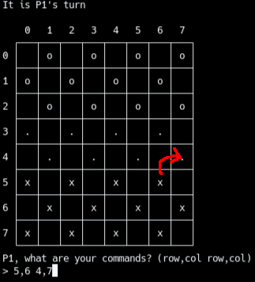
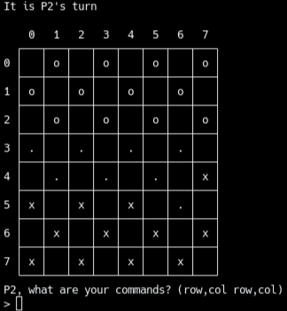
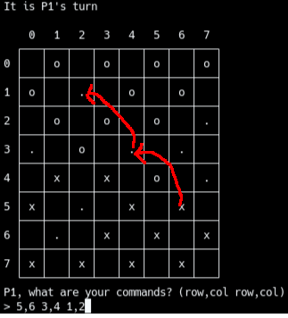
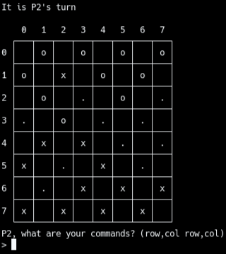

# Python-Terminal-Checkers-Draughts
Made in Python, this Checkers / Draughts (depends on where you're from) game can be really fun to play with friends. Perhaps you should mention it to others. (This is your brain speaking, not some lame attempt at gaining popularity. ¬‿¬)

## How to Play:
####
- P1's normal pieces are marked with an 'x'.
- P2's normal pieces are marked with an 'o'.
- P1's king pieces are marked with an 'X'.
- P2's king pieces are marked with an 'O'.
####
Each player will take turns making a move.

A piece can only be moved diagonally.

Example:

If an opponent's piece is in diagonal with yours with an empty space on the opposite side of your oppenent, you can jump over that piece.

Jumping over a piece removes it from the board.

You must jump over a piece if you can.

If you jump over a piece, you must continue jumping over pieces (with that one piece) until you can't jump over any more.

Reaching the opposite end of the board will 'king' that piece, making that piece a king piece.

King pieces can move diagonally in all directions with the same movement speeds as a regular piece.

The game ends when on a player's turn, they cannot move any of their pieces or they no longer have any pieces.

Disclaimer:
I'm not responsible for any losses due to this game.

The game should remain a game, gambling is not recommended.

## Other Information
[Basic Code Information](docs/CodeInfo.md)

[Updates File](docs/Updates.md)

Made with [Replit](https://replit.com)
